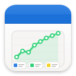

# Assets

<p align="center">
  
</p>

<p align="center">
  <strong>Visual Node-Based Data Analysis for Financial Markets</strong>
</p>

<p align="center">
  A professional GNOME application for financial and economic data analysis using a visual node-based programming interface.
</p>

---

## Overview

**Assets** is a modern GTK4/Libadwaita application designed for economists, financial analysts, and data scientists who need to analyze market data, economic indicators, and financial assets in a visual, intuitive way.

Instead of writing traditional scripts, you create analysis workflows by connecting visual nodes on a canvas. Each node represents a data operation (fetch data, transform, calculate, visualize), making complex data pipelines easy to understand and modify.

## Features

### Visual Node Editor
- **Drag-and-drop canvas**: Create data workflows visually
- **Node-based programming**: Connect nodes to build analysis pipelines
- **Type-safe connections**: Ports are color-coded by data type (DataFrame, Array, Figure, etc.)
- **Real-time execution**: See results immediately in the output panel
- **Zoom and pan**: Navigate large workflows easily
- **Multi-selection**: Select and move multiple nodes at once

### Data Analysis Capabilities
- **Financial data integration**: Fetch data from Yahoo Finance and other sources
- **Python code nodes**: Write custom Python code within nodes
- **Data transformations**: Filter, aggregate, and manipulate datasets
- **Visualization**: Create charts and plots (matplotlib integration)
- **Group nodes**: Organize complex workflows into reusable components

### Professional Workflow
- **Save/Load projects**: Persist your analysis workflows
- **Node library**: Save and reuse custom nodes across projects
- **Undo/Redo**: Full undo history for all operations
- **Keyboard shortcuts**: Efficient navigation and editing
- **Output panel**: View results, console output, and errors
- **Modern GNOME design**: Clean, native interface following GNOME HIG

## Installation

### Dependencies

- GTK 4.0
- Libadwaita 1.0
- Python 3.12+
- Cairo
- Meson build system

### Build from Source

```bash
# Navigate to the project directory
cd /path/to/Assets

# Build with Meson
meson setup builddir
meson compile -C builddir

# Install (optional)
meson install -C builddir

# Or run directly
./builddir/src/assets
```

### Flatpak (Recommended)

```bash
# Build and install as Flatpak
flatpak-builder --user --install --force-clean flatpak_app com.github.sheep.farm.assets.json

# Run the application
flatpak run com.github.sheep.farm.assets
```

## Quick Start

### Creating Your First Workflow

1. **Add nodes**: Right-click on the canvas → "Add Node from Library"
2. **Connect nodes**: Click and drag from output ports (right) to input ports (left)
3. **Configure nodes**: Double-click nodes to edit their code/parameters
4. **Execute**: Click "Run" or press F5 to execute the workflow
5. **View results**: Check the Output panel for results and visualizations

### Example: Fetching Stock Data

```
[Yahoo Finance] → [Data Filter] → [Plot Chart] → [Output]
```

1. Add a "Yahoo Finance" node and set the ticker symbol
2. Connect it to a data transformation node
3. Connect to a visualization node
4. Execute to see the chart

## Node Types

### Data Sources
- **Yahoo Finance**: Fetch stock/market data
- **FRED API**: Economic indicators
- **CSV Import**: Load local datasets

### Transformations
- **Filter**: Select rows/columns
- **Aggregate**: Group and summarize data
- **Calculate**: Custom calculations
- **Merge**: Combine multiple datasets

### Outputs
- **Plot**: Create charts (line, bar, scatter, etc.)
- **Table**: Display tabular data
- **Export**: Save results to files

### Utilities
- **Code**: Execute custom Python code
- **Group**: Organize nodes into reusable components
- **Comment**: Add documentation to your workflow

## Keyboard Shortcuts

| Shortcut | Action |
|----------|--------|
| `Ctrl+N` | New project |
| `Ctrl+O` | Open project |
| `Ctrl+S` | Save project |
| `Ctrl+Shift+S` | Save as... |
| `Ctrl+Z` | Undo |
| `Ctrl+Shift+Z` | Redo |
| `Ctrl+C` | Copy selected nodes |
| `Ctrl+V` | Paste nodes |
| `Ctrl+D` | Duplicate selected nodes |
| `Delete` | Delete selected nodes |
| `F5` | Run workflow |
| `Tab` | Navigate between nodes |
| `Arrow Keys` | Move selected node |
| `+/-` | Zoom in/out |
| `Ctrl+0` | Reset zoom |

## Development

### Project Structure

```
Assets/
├── src/
│   ├── main.py              # Application entry point
│   ├── window.py            # Main window
│   ├── canvas.py            # Node canvas implementation
│   ├── node.py              # Node class
│   ├── node_library.py      # Node library system
│   ├── node_dialogs.py      # Node configuration dialogs
│   ├── output_panel.py      # Results output panel
│   ├── graph_io.py          # Save/load functionality
│   ├── undo_redo.py         # Undo/Redo manager
│   └── blp/                 # Blueprint UI files
├── data/
│   ├── icons/               # Application icons
│   ├── *.desktop.in         # Desktop entry
│   └── *.metainfo.xml.in    # AppStream metadata
├── po/                      # Translations
├── wheels/                  # Python dependencies
└── meson.build             # Build configuration
```

### Adding Custom Nodes

Nodes are defined in JSON files in `~/.nodes/`:

```json
{
  "Data Sources": {
    "icon": "📊",
    "nodes": [
      {
        "name": "My Data Source",
        "description": "Custom data loader",
        "num_inputs": 0,
        "num_outputs": 1,
        "default_code": "# Your Python code here\n_data = load_data()",
        "tags": ["data", "custom"],
        "category": "Data Sources"
      }
    ]
  }
}
```

## Status

This project is currently in **active development**. Features and APIs may change.

### Planned Features
- [ ] Additional data sources (Alpha Vantage, Quandl, etc.)
- [ ] More visualization types
- [ ] Export workflows as standalone scripts
- [ ] Collaborative features
- [ ] Plugin system
- [ ] Cloud data storage integration

## License

This project is licensed under the GNU General Public License v3.0 or later.

See [COPYING](COPYING) for details.

## Author

**Flavio de Vasconcellos Corrêa** ([@sheep-farm](https://github.com/sheep-farm))

## Technologies

- **GTK 4** & **Libadwaita** - User Interface
- **Python 3** - Core logic
- **Cairo** - Canvas rendering
- **Meson** - Build system
- **Yahoo Finance API** - Market data

---

<p align="center">
  <em>A visual approach to financial data analysis</em>
</p>
